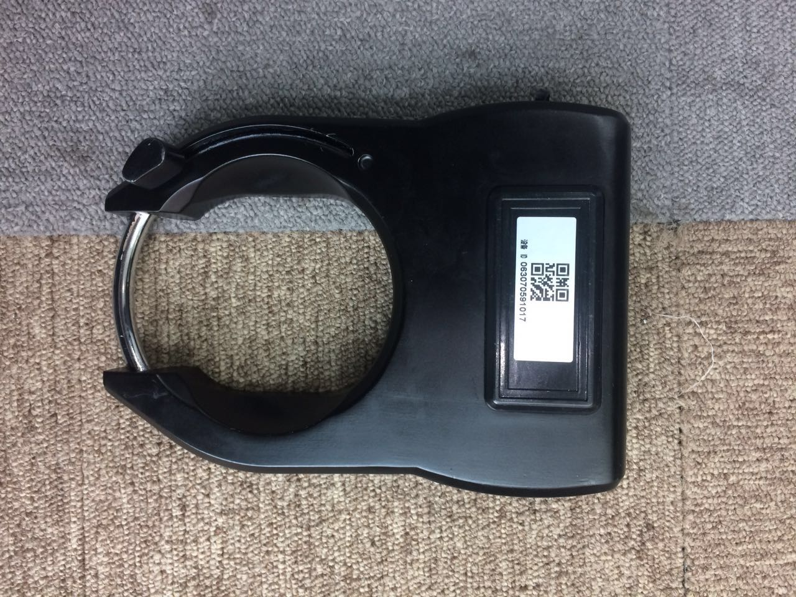
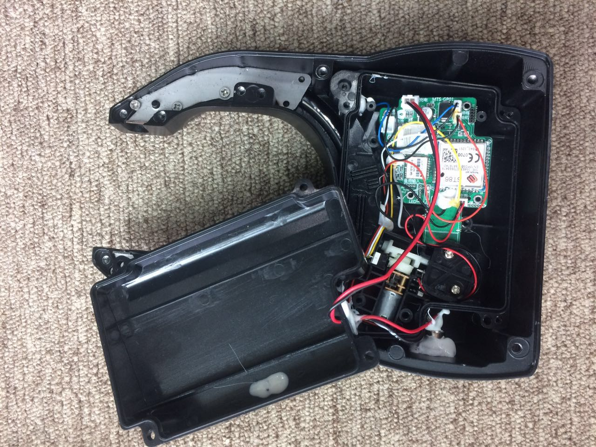
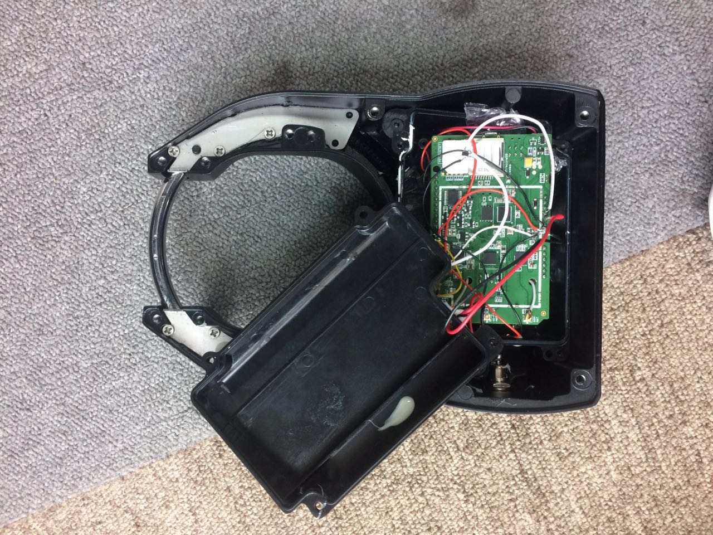
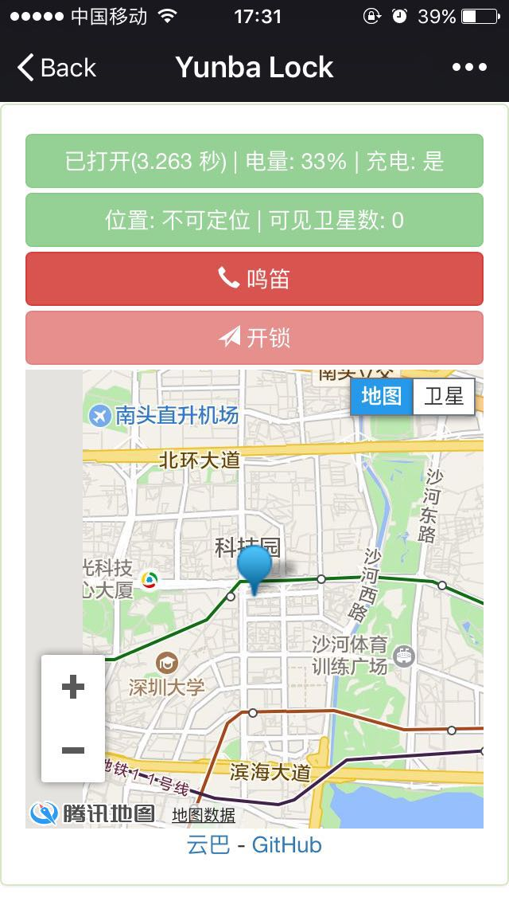
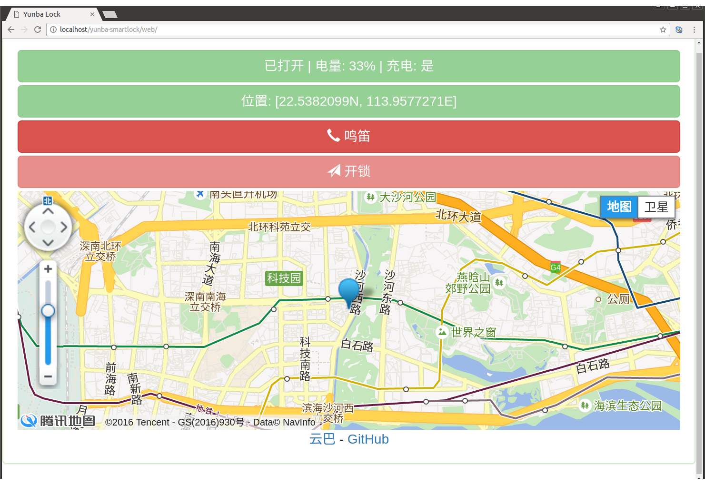

# 云巴物联锁

这里简单介绍将市面上的单车锁改造集成 [云巴服务](https://yunba.io/) 的过程，使用云巴服务，我们能更实时的远程开锁，以及获取锁的状态。

## 硬件接线

先看一下锁的外观，如下图：

拆开后如下：

可以发现是一个 GPRS 模块实现网络通信；一个直流电机来驱动一个插销开锁，还有两个能用于检测锁状态和电机转动状态的开关，由这些元件，我们就可以控制电机开锁，另外当锁被拉回锁住状态时，还需要锁紧插销。

为了能使用我们自己开发的程序，我们使用 [LinkIt ONE](https://labs.mediatek.com/en/platform/linkit-one) 来替代原来的电路板，替换后是这个样子：

我们使用 LinkIt ONE 的 GPRS 实现网络通信，使用数字 I/O 口来读取开关状态，以及控制电机，需要注意的是 LinkIt ONE 的驱动电流很小，驱动不了电机，所以我们将电机直接接在电源上，用一个场效应管来作电子开关控制电机 VCC 是否导通。详细连线如下表：

| 锂电池 | LinkIt ONE | 电机 | 蜂鸣器 | 场效应管(AFZV18) | 锁状态检测 | 电机状态检测 |
|--------|--------|--------|--------|--------|--------|--------|
| 5V | 5V |  |  |  |  |  |
| GND | GND | GND | GND |  | COM | COM |
|  | 3.3V |  |  | 源极 |  |  |
|  | D0 |  |  | 栅极 |
|  | D5 |  |  |  | NO |  |
|  | D6 |  |  |  |  | NO |
|  | D7 |  | VCC |  |  |  |
|  |  | VCC |  | 漏极 |  |  |

## 软件

在 LinkIt ONE 上使用 [云巴 Arduino SDK](https://github.com/yunba/yunba-arduino-sdk) 可以很容易的集成云巴服务，详细代码参考：[sketch_smartlock.ino](https://github.com/yunbademo/yunba-smartlock/blob/master/sketch_smartlock/sketch_smartlock.ino)。

## web 界面

使用 H5 快速的实现一个管理界面，这里需要使用的是 [云巴 Javascript SDK](https://github.com/yunba/yunba-javascript-sdk),参考：[web](https://github.com/yunbademo/yunba-smartlock/tree/master/web)，也可以参考 [Javascript SDK 文档](https://yunba.io/docs/js_sdk_quick_start)，管理界面如下：

